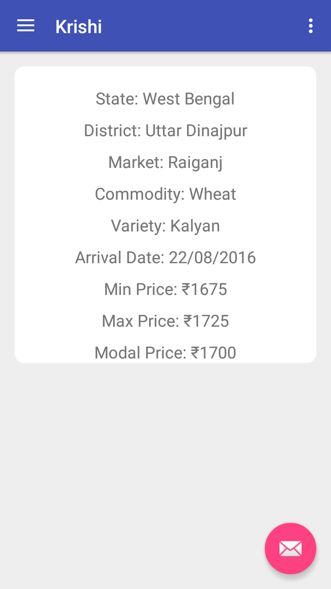
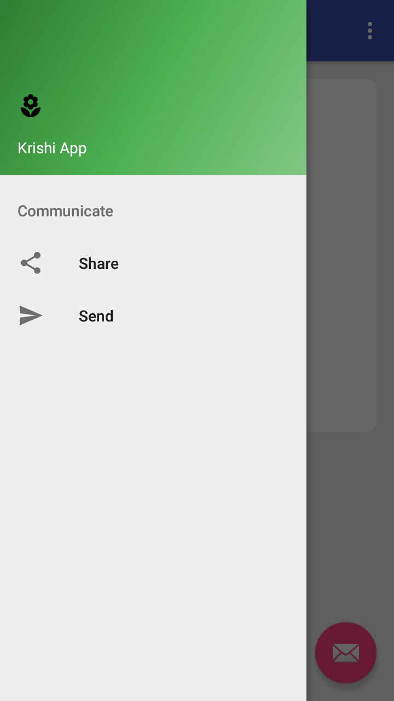

## Krishi - App for Farmers

To use and build this app, you will need to have an API KEY from [https://data.gov.in/](https://data.gov.in/). Get one by creating an account then add the
 API key to
   `$HOME/.gradle/gradle.properties`
   
   ```bash
   MyGovToken="XXXXXXXXXXXXXXXXXXXXXXXXXXXXXXX"
   ```
   
   Alpha Preview 
   
   
   
   
   
   
   
   